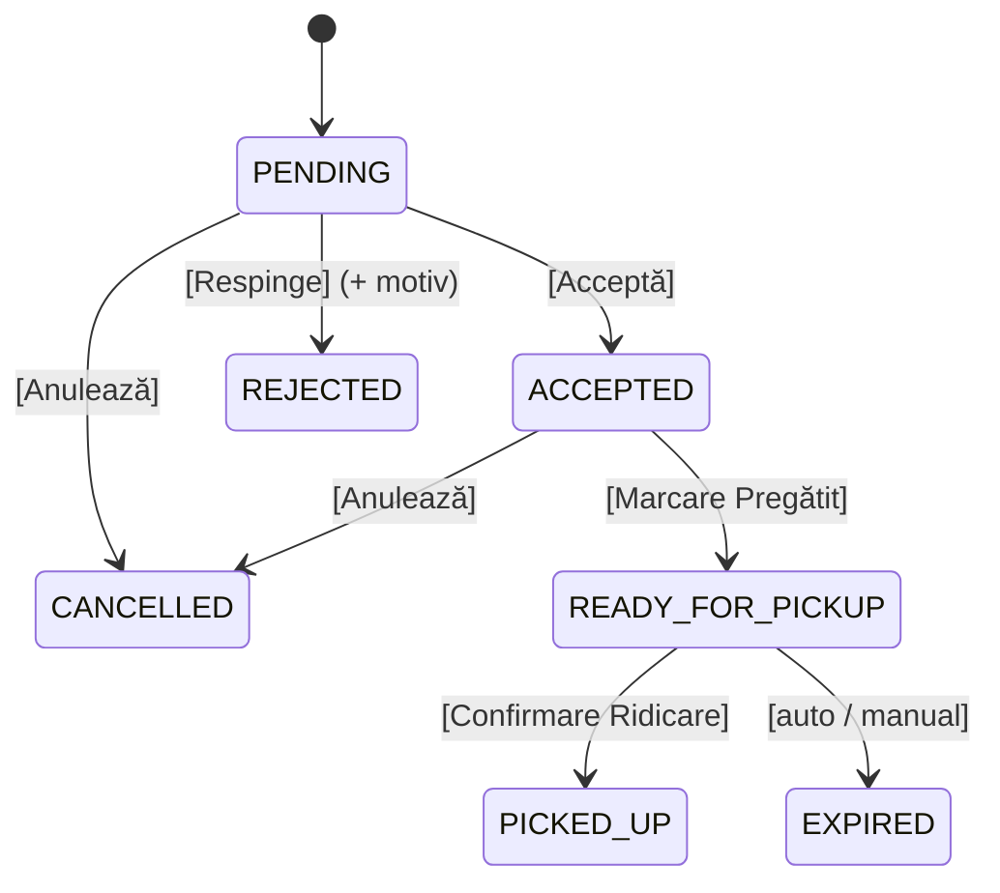

# 📋 Propunere Structură Admin Panel — MedFinder (v1)

> **Status: ⏳ În așteptarea validării**
> Acest document descrie complet paginile, componentele, rutele și permisiunile Admin Panel-ului MedFinder.
> Referință entități: [`entity_structure_proposal.md`](file:///c:/Users/Sebi/Desktop/master/Semestru2/INNO/Project/innovation-management/entity_structure_proposal.md)

---

## 🛠 Stack Tehnologic — Recomandare

### Decizie: **Thymeleaf + Bootstrap 5 + Chart.js + Spring Security**

| Tehnologie | Rol | Mod de includere |
|---|---|---|
| **Thymeleaf** | Template engine (server-side rendering) | Dependență Maven/Gradle (`spring-boot-starter-thymeleaf`) |
| **Thymeleaf Layout Dialect** | Layout decorator pattern (sidebar + header + content) | Dependență Maven/Gradle (`thymeleaf-layout-dialect`) |
| **Bootstrap 5.3** | UI framework (tabele, carduri, formulare, navbar, modals) | CDN — fără npm/webpack |
| **Bootstrap Icons** | Iconițe pentru sidebar/acțiuni | CDN |
| **Chart.js 4** | Grafice și statistici (bar, line, pie, doughnut) | CDN |
| **Spring Security** | Autentificare (form login) + autorizare (role-based) | Dependență Maven/Gradle (`spring-boot-starter-security`) |

### De ce această combinație?

| Criteriu | Thymeleaf + Bootstrap | SPA (React/Vue) | Vaadin |
|---|---|---|---|
| **Timp de implementare** | ✅ Rapid — un singur proiect | ❌ Lent — 2 proiecte (frontend + API) | ⚠️ Mediu — learning curve |
| **Complexitate** | ✅ Minimă — server-rendered | ❌ Ridicată — state management, routing, auth tokens | ⚠️ Medie |
| **Integrare Spring** | ✅ Nativă — controllers returnează view-uri direct | ⚠️ Necesită REST API separat | ✅ Nativă |
| **Autentificare** | ✅ Spring Security form login (sesiuni) | ❌ JWT + refresh tokens + CORS | ✅ Sesiuni |
| **Aspect profesional** | ✅ Bootstrap = UI matură, responsive | ✅ Cel mai flexibil | ⚠️ Look specific Vaadin |
| **Interactivitate** | ⚠️ Full page reload (dar suficient pt admin) | ✅ SPA fluid | ✅ Real-time |

> **Concluzie:** Pentru un admin panel cu deadline la finalul săptămânii, Thymeleaf + Bootstrap 5 este opțiunea optimă — un singur codebase, zero tooling frontend, aspect profesional out-of-the-box.

---

## 🏗 Arhitectura Layout-ului

```
┌──────────────────────────────────────────────────────────────┐
│  🏥 MedFinder    │     Top Navbar           │ User ▾ Logout │
├──────────────────┼───────────────────────────────────────────┤
│                  │                                           │
│   S I D E B A R  │                                           │
│                  │           C O N T E N T                   │
│   (navigare      │           A R E A                         │
│    diferită       │                                           │
│    per rol)       │   (pagina curentă — tabel, formular,     │
│                  │    dashboard, etc.)                       │
│   📊 Dashboard   │                                           │
│   💊 Medicamente │                                           │
│   🏥 Farmacii    │                                           │
│   📦 Comenzi     │                                           │
│   🔄 Sync        │                                           │
│   ...            │                                           │
├──────────────────┴───────────────────────────────────────────┤
│                     Footer — © 2026 MedFinder                │
└──────────────────────────────────────────────────────────────┘
```

### Template-uri Thymeleaf — Structura fișierelor

```
src/main/resources/templates/
├── layout/
│   └── admin.html               ← layout principal (sidebar + header + footer)
├── fragments/
│   ├── sidebar.html             ← navigare laterală (condiționată per rol)
│   ├── header.html              ← navbar superior + user info
│   ├── footer.html              ← footer
│   └── pagination.html          ← componentă reutilizabilă de paginare
├── auth/
│   ├── login.html               ← pagina de login
│   └── register.html            ← pagina de creare cont
├── admin/
│   ├── dashboard.html           ← dashboard cu stats + grafice (per rol)
│   ├── medications/
│   │   ├── list.html            ← tabel medicamente (CRUD)
│   │   └── form.html            ← formular creare/editare medicament
│   ├── pharmacies/
│   │   ├── list.html            ← tabel farmacii
│   │   └── form.html            ← formular creare/editare farmacie
│   ├── locations/
│   │   ├── list.html            ← tabel locații (per farmacie)
│   │   └── form.html            ← formular creare/editare locație
│   ├── users/
│   │   ├── clients.html         ← tabel clienți
│   │   ├── pharm-owners.html    ← tabel proprietari farmacii
│   │   ├── pharmacists.html     ← tabel farmaciști
│   │   └── form.html            ← formular creare/editare user
│   ├── orders/
│   │   ├── list.html            ← tabel comenzi
│   │   └── view.html            ← detalii comandă + acțiuni status
│   ├── sync/
│   │   ├── manage.html          ← declanșare sync + config
│   │   └── logs.html            ← istoric sincronizări
│   └── error/
│       ├── 403.html             ← acces interzis
│       └── 404.html             ← pagină negăsită
└── error.html                   ← eroare generală
```

### Java Packages — Structura backend-ului

```
ro.medfinder.medapp/
├── entity/                ← ✅ DONE (faza anterioară)
│   └── enums/
├── repository/            ← Spring Data JPA Repositories
├── service/               ← Logica de business
├── controller/            ← Spring MVC Controllers
├── config/                ← SecurityConfig, WebMvcConfig
└── dto/                   ← Data Transfer Objects pentru formulare
```

---

## 🔐 Autentificare & Autorizare

### Pagina de Login (`/auth/login`)

| Element | Detalii |
|---|---|
| **Câmpuri** | Email + Parolă |
| **Validare** | Email format, câmpuri obligatorii |
| **Erori** | Mesaj generic "Credențiale invalide" (fără leak de informații) |
| **Redirect după login** | → `/admin/dashboard` |
| **Design** | Card centrat, logo MedFinder, culori brand |

### Pagina de Creare Cont (`/auth/register`)

| Element | Detalii |
|---|---|
| **Câmpuri comune** | Email, Parolă, Confirmare Parolă, Prenume, Nume, Telefon |
| **Selectare rol** | Dropdown: `PHARM_OWNER`, `PHARMACIST` (nu `CLIENT` — clienții se înregistrează din Storefront; nu `SUPER_USER` — creat manual/seed) |
| **Câmpuri condiționale** | Dacă PHARM_OWNER → + Company Name |
| **Validare** | Email unic, parolă min 8 caractere, match confirmare |
| **Redirect după register** | → `/auth/login` cu mesaj succes |

### Spring Security — Matrice de acces

| Rută | SUPER_USER | PHARM_OWNER | PHARMACIST | Anonim |
|---|---|---|---|---|
| `/auth/**` | ✅ | ✅ | ✅ | ✅ |
| `/admin/dashboard` | ✅ | ✅ | ✅ | ❌ |
| `/admin/medications/**` | ✅ CRUD ALL | ✅ READ own | ✅ READ+UPDATE own | ❌ |
| `/admin/pharmacies/**` | ✅ CRUD ALL | ✅ CRUD own | ❌ | ❌ |
| `/admin/locations/**` | ✅ CRUD ALL | ✅ CRUD own | ✅ READ own | ❌ |
| `/admin/users/clients/**` | ✅ | ❌ | ❌ | ❌ |
| `/admin/users/pharm-owners/**` | ✅ | ❌ | ❌ | ❌ |
| `/admin/users/pharmacists/**` | ✅ | ✅ own | ❌ | ❌ |
| `/admin/orders/**` | ✅ ALL | ✅ own pharmacies | ✅ own location | ❌ |
| `/admin/sync/**` | ✅ ALL | ✅ own pharmacies | ✅ own location | ❌ |

> **"own"** = filtrat automat pe baza utilizatorului logat:
> - PHARM_OWNER vede doar farmaciile unde `owner_id = currentUser.id`
> - PHARMACIST vede doar locația unde `location_id = currentUser.location.id`

### Logout (`/auth/logout`)

POST request → invalidare sesiune → redirect `/auth/login?logout`

---

## 📊 Dashboard (`/admin/dashboard`)

> Conținut diferit per rol — aceleași componente UI, date diferite.

### Stats Cards (4 carduri în rând)

| # | SUPER_USER | PHARM_OWNER | PHARMACIST |
|---|---|---|---|
| 1 | 👥 Total Utilizatori | 🏥 Farmaciile Mele (count) | 💊 Medicamente în stoc |
| 2 | 🏥 Total Farmacii | 📍 Total Locații (own) | 📦 Comenzi azi |
| 3 | 💊 Total Medicamente | 📦 Comenzi azi (own) | ⏳ Comenzi PENDING |
| 4 | 📦 Comenzi azi | 💰 Venit azi (own) | ✅ Comenzi finalizate (săptămână) |

### Grafice (Chart.js)

| # | SUPER_USER | PHARM_OWNER | PHARMACIST |
|---|---|---|---|
| 1 | 📈 Comenzi per zi (ultimele 30 zile) — Line | 📈 Comenzi per zi (own, 30 zile) — Line | 📈 Comenzi per zi (own location, 7 zile) — Line |
| 2 | 🍩 Comenzi per status — Doughnut | 🍩 Comenzi per status (own) — Doughnut | 🍩 Comenzi per status (own) — Doughnut |
| 3 | 📊 Top 10 medicamente comandate — Bar | 📊 Top 10 medicamente (own) — Bar | 📊 Stoc medicamente (low stock alert) — Bar |
| 4 | 🥧 Distribuție farmacii per județ — Pie | 💰 Venit per farmacie — Bar | — |

### Tabel activitate recentă

- Ultimele 10 comenzi (filtrate per rol)
- Coloane: `#Comandă`, `Client`, `Locație`, `Status` (badge colorat), `Total`, `Data`

---

## 💊 Pagina Medicamente (`/admin/medications`)

### Tabel principal

| Coloană | Sortabil | Filtrabil |
|---|---|---|
| EAN | ✅ | ✅ (search) |
| Nume | ✅ | ✅ (search) |
| Substanță activă | ✅ | ✅ (search) |
| Formă | ✅ | ✅ (dropdown MedForm) |
| Dozaj | — | — |
| Categorie | ✅ | ✅ (dropdown) |
| Rețetă necesară | — | ✅ (da/nu) |
| Acțiuni | — | — |

### Acțiuni per rând

| Acțiune | SUPER_USER | PHARM_OWNER | PHARMACIST |
|---|---|---|---|
| 👁 Vizualizare | ✅ | ✅ | ✅ |
| ✏️ Editare | ✅ | ❌ | ❌ |
| 🗑 Ștergere | ✅ | ❌ | ❌ |
| ➕ Adaugă nou | ✅ (buton sus) | ❌ | ❌ |

### Formular creare/editare (`/admin/medications/new` | `/admin/medications/{id}/edit`)

- Toate câmpurile din entitatea `Medication`
- Dropdown pentru `form` (MedForm enum)
- Checkbox pentru `prescriptionRequired`
- Textarea pentru `description`
- Validare server-side + mesaje eroare pe câmp

### Filtrare per rol

| Rol | Ce vede |
|---|---|
| SUPER_USER | TOATE medicamentele din nomenclator |
| PHARM_OWNER | Medicamentele din stocul farmaciilor proprii (via MedStock → Location → Pharmacy.owner_id) |
| PHARMACIST | Medicamentele din stocul locației proprii (via MedStock → Location.id = user.location_id) |

---

## 🏥 Pagina Farmacii (`/admin/pharmacies`)

> Vizibilă doar pentru **SUPER_USER** și **PHARM_OWNER**.

### Tabel principal

| Coloană | Detalii |
|---|---|
| Nume | Numele farmaciei |
| CUI | Cod Unic de Identificare |
| Proprietar | Nume PharmOwner |
| Nr. Locații | Count locații active |
| Sync Activ | Badge da/nu |
| Status | Badge Activ/Inactiv |
| Acțiuni | View, Edit, Toggle Active |

### Filtrare per rol

| Rol | Ce vede |
|---|---|
| SUPER_USER | TOATE farmaciile |
| PHARM_OWNER | Doar farmaciile proprii (`owner_id = currentUser.id`) |

### Formular creare/editare (`/admin/pharmacies/new` | `/admin/pharmacies/{id}/edit`)

- Câmpuri: name, cui, phone, email, website, logoUrl, syncEnabled, syncEndpointUrl
- SUPER_USER poate selecta owner-ul (dropdown PharmOwner)
- PHARM_OWNER → owner setat automat la user-ul curent

### Pagina detalii farmacie (`/admin/pharmacies/{id}`)

- Informații farmacie
- Tab-uri sau secțiuni:
  - **Locații** — tabel cu locațiile farmaciei, buton adaugă
  - **Farmaciști** — tabel cu farmaciștii din locațiile farmaciei
  - **Sync Config** — endpoint, status sync, ultimul sync

---

## 📍 Pagina Locații (`/admin/locations`)

### Tabel principal

| Coloană | Detalii |
|---|---|
| Nume | "Sucursala Unirii" |
| Adresă | Adresa completă |
| Oraș | — |
| Județ | — |
| Farmacie | Numele farmaciei-mamă |
| Nr. Medicamente | Count medicamente în stoc |
| Status | Badge Activ/Inactiv |
| Acțiuni | View, Edit |

### Filtrare per rol

| Rol | Ce vede |
|---|---|
| SUPER_USER | TOATE locațiile |
| PHARM_OWNER | Locațiile farmaciilor proprii |
| PHARMACIST | Doar locația proprie |

### Formular creare/editare (`/admin/locations/new` | `/admin/locations/{id}/edit`)

- Câmpuri: name, address, city, county, postalCode, latitude, longitude, phone, active
- Dropdown farmacie-mamă (filtrat per rol)
- Secțiune **Program de lucru** — 7 rânduri (Luni–Duminica):
  - Ora deschidere (time picker)
  - Ora închidere (time picker)
  - Checkbox "Închis"

### Pagina detalii locație (`/admin/locations/{id}`)

- Informații locație + program de lucru
- Tabel farmaciști la această locație
- Tabel stoc medicamente (preț, cantitate, disponibil)

---

## 👥 Pagini Utilizatori

> Vizibile doar pentru **SUPER_USER** (all users) și parțial **PHARM_OWNER** (farmaciștii proprii).

### `/admin/users/clients` — Lista Clienți

| Coloană | Detalii |
|---|---|
| Nume | firstName + lastName |
| Email | — |
| Telefon | — |
| Oraș | — |
| Nr. Comenzi | Count comenzi |
| Status | Activ/Inactiv |
| Acțiuni | View, Toggle Enable |

> Doar SUPER_USER. CRUD limitat — nu se creează clienți din admin (vin din Storefront).

### `/admin/users/pharm-owners` — Lista Proprietari Farmacii

| Coloană | Detalii |
|---|---|
| Nume | firstName + lastName |
| Email | — |
| Companie | companyName |
| Nr. Farmacii | Count farmacii |
| Status | Activ/Inactiv |
| Acțiuni | View, Edit, Toggle Enable |

> Doar SUPER_USER.

### `/admin/users/pharmacists` — Lista Farmaciști

| Coloană | Detalii |
|---|---|
| Nume | firstName + lastName |
| Email | — |
| Farmacie | pharmacy.name (via location) |
| Locație | location.name |
| Status | Activ/Inactiv |
| Acțiuni | View, Edit, Asignare Locație |

| Rol | Ce vede |
|---|---|
| SUPER_USER | Toți farmaciștii |
| PHARM_OWNER | Farmaciștii din farmaciile/locațiile proprii |

---

## 📦 Pagina Comenzi (`/admin/orders`)

### Tabel principal

| Coloană | Detalii |
|---|---|
| Nr. Comandă | `ORD-20260615-0042` |
| Client | Nume client |
| Farmacie | Numele farmaciei |
| Locație pickup | Numele locației |
| Status | Badge colorat (PENDING=galben, ACCEPTED=albastru, READY=verde, PICKED_UP=gri, REJECTED=roșu, CANCELLED=gri, EXPIRED=portocaliu) |
| Total | RON, formatat |
| Data | createdAt formatat |
| Acțiuni | View, Change Status |

### Filtre disponibile

- **Status** — dropdown multi-select
- **Dată** — interval (de la — până la)
- **Farmacie** — dropdown (filtrat per rol)
- **Search** — după nr. comandă sau nume client

### Filtrare per rol

| Rol | Ce vede |
|---|---|
| SUPER_USER | TOATE comenzile |
| PHARM_OWNER | Comenzile din locațiile farmaciilor proprii |
| PHARMACIST | Comenzile din locația proprie |

### Pagina detalii comandă (`/admin/orders/{id}`)

- Info client, locație pickup, date/ore
- Tabel OrderItems: medicament, cantitate, preț unitar, subtotal
- Status curent + butoane de tranziție:



- Butoanele de acțiune sunt contextuale (doar tranzițiile valide pentru statusul curent)
- La REJECTED → modal cu câmp `rejectionReason`

---

## 🔄 Pagina Sincronizare (`/admin/sync`)

### Secțiune 1: Declanșare Sync

| Element | Detalii |
|---|---|
| Selectare Farmacie | Dropdown (filtrat per rol) |
| Tip Sync | Radio: CSV Upload / Manual |
| Upload CSV | File input (apare doar pentru CSV) |
| Buton "Începe Sync" | Declanșează procesul |

### Secțiune 2: Istoric Sync-uri (SyncLog)

| Coloană | Detalii |
|---|---|
| Farmacie | Numele farmaciei |
| Tip | CSV / ERP_API / MANUAL |
| Status | Badge: IN_PROGRESS=albastru, SUCCESS=verde, PARTIAL_FAILURE=portocaliu, FAILED=roșu |
| Fișier | Numele fișierului CSV (dacă e cazul) |
| Înregistrări | Total / Procesate / Eșuate |
| Declanșat de | Numele user-ului |
| Început la | Timestamp |
| Finalizat la | Timestamp |
| Erori | Expandable — detalii erori |

---

## 🎨 Design & Componente UI

### Culori Brand (tema Admin)

| Element | Culoare | Utilizare |
|---|---|---|
| Primary | `#0d6efd` (Bootstrap blue) | Butoane principale, linkuri active |
| Sidebar BG | `#212529` (dark) | Sidebar background |
| Sidebar Active | `#0d6efd` | Item activ în sidebar |
| Success | `#198754` | Stări pozitive, badge-uri succes |
| Warning | `#ffc107` | PENDING, atenționări |
| Danger | `#dc3545` | Erori, ștergeri, REJECTED |
| Info | `#0dcaf0` | Informații, ACCEPTED |

### Componente reutilizabile (Thymeleaf fragments)

1. **Stats Card** — icon + valoare + label + trend (opțional)
2. **Data Table** — Bootstrap table + search + pagination
3. **Status Badge** — culoare per status (enum → culoare mapping)
4. **Action Buttons** — View/Edit/Delete cu iconițe
5. **Form Group** — label + input + error message
6. **Confirm Modal** — confirmare ștergere/acțiuni distructive
7. **Alert Messages** — succes/eroare/info după acțiuni CRUD
8. **Breadcrumb** — navigare contextuală

---

## 📐 Sidebar — Navigare per Rol

### SUPER_USER

```
📊 Dashboard
── MANAGEMENT ──
💊 Medicamente
🏥 Farmacii
📍 Locații
── UTILIZATORI ──
👤 Clienți
🏢 Proprietari Farmacii
👨‍⚕️ Farmaciști
── OPERAȚIUNI ──
📦 Comenzi
🔄 Sincronizare
```

### PHARM_OWNER

```
📊 Dashboard
── FARMACIILE MELE ──
🏥 Farmacii
📍 Locații
💊 Stoc Medicamente
👨‍⚕️ Farmaciști
── OPERAȚIUNI ──
📦 Comenzi
🔄 Sincronizare
```

### PHARMACIST

```
📊 Dashboard
── LOCAȚIA MEA ──
📍 Detalii Locație
💊 Stoc Medicamente
── OPERAȚIUNI ──
📦 Comenzi
🔄 Sincronizare
```

---

## 🗺 Harta Rutelor (URL Mapping)

| Rută | Controller | Metode HTTP | Descriere |
|---|---|---|---|
| `GET /auth/login` | AuthController | GET | Formular login |
| `POST /auth/login` | Spring Security | POST | Procesare login |
| `GET /auth/register` | AuthController | GET | Formular înregistrare |
| `POST /auth/register` | AuthController | POST | Procesare înregistrare |
| `POST /auth/logout` | Spring Security | POST | Logout |
| `GET /admin/dashboard` | DashboardController | GET | Dashboard per rol |
| `GET /admin/medications` | MedicationController | GET | Lista medicamente |
| `GET /admin/medications/new` | MedicationController | GET | Formular adăugare |
| `POST /admin/medications` | MedicationController | POST | Salvare medicament nou |
| `GET /admin/medications/{id}/edit` | MedicationController | GET | Formular editare |
| `POST /admin/medications/{id}` | MedicationController | POST | Update medicament |
| `POST /admin/medications/{id}/delete` | MedicationController | POST | Ștergere medicament |
| `GET /admin/pharmacies` | PharmacyController | GET | Lista farmacii |
| `GET /admin/pharmacies/new` | PharmacyController | GET | Formular adăugare |
| `POST /admin/pharmacies` | PharmacyController | POST | Salvare farmacie |
| `GET /admin/pharmacies/{id}` | PharmacyController | GET | Detalii farmacie |
| `GET /admin/pharmacies/{id}/edit` | PharmacyController | GET | Formular editare |
| `POST /admin/pharmacies/{id}` | PharmacyController | POST | Update farmacie |
| `GET /admin/locations` | LocationController | GET | Lista locații |
| `GET /admin/locations/new` | LocationController | GET | Formular adăugare |
| `POST /admin/locations` | LocationController | POST | Salvare locație |
| `GET /admin/locations/{id}` | LocationController | GET | Detalii locație |
| `GET /admin/locations/{id}/edit` | LocationController | GET | Formular editare |
| `POST /admin/locations/{id}` | LocationController | POST | Update locație |
| `GET /admin/users/clients` | UserController | GET | Lista clienți |
| `GET /admin/users/pharm-owners` | UserController | GET | Lista proprietari |
| `GET /admin/users/pharmacists` | UserController | GET | Lista farmaciști |
| `GET /admin/users/{id}/edit` | UserController | GET | Formular editare user |
| `POST /admin/users/{id}` | UserController | POST | Update user |
| `POST /admin/users/{id}/toggle` | UserController | POST | Activare/dezactivare |
| `GET /admin/orders` | OrderController | GET | Lista comenzi |
| `GET /admin/orders/{id}` | OrderController | GET | Detalii comandă |
| `POST /admin/orders/{id}/status` | OrderController | POST | Schimbare status comandă |
| `GET /admin/sync` | SyncController | GET | Pagina sync |
| `POST /admin/sync/trigger` | SyncController | POST | Declanșare sync |
| `GET /admin/sync/logs` | SyncController | GET | Istoric sync-uri |

---

## 📂 Fișiere Java de Creat

### Repositories (`ro.medfinder.medapp.repository`)

| Fișier | Entitate | Query-uri custom |
|---|---|---|
| `UserRepository.java` | User | `findByEmail()`, `findByRole()` |
| `ClientRepository.java` | Client | — |
| `PharmOwnerRepository.java` | PharmOwner | — |
| `PharmacistRepository.java` | Pharmacist | `findByLocationId()`, `findByLocationPharmacyOwnerId()` |
| `PharmacyRepository.java` | Pharmacy | `findByOwnerId()` |
| `LocationRepository.java` | Location | `findByPharmacyId()`, `findByPharmacyOwnerId()` |
| `WorkingHourRepository.java` | WorkingHour | `findByLocationId()` |
| `MedicationRepository.java` | Medication | `findByNameContaining()`, `findByEan()` |
| `MedStockRepository.java` | MedStock | `findByLocationId()`, `findByLocationPharmacyOwnerId()` |
| `OrderRepository.java` | Order | `findByClientId()`, `findByPickupLocationId()`, `findByStatus()`, count queries |
| `OrderItemRepository.java` | OrderItem | `findByOrderId()` |
| `NotificationRepository.java` | Notification | `findByRecipientId()` |
| `SyncLogRepository.java` | SyncLog | `findByPharmacyId()`, `findByPharmacyOwnerId()` |

### Services (`ro.medfinder.medapp.service`)

| Fișier | Responsabilități |
|---|---|
| `UserService.java` | Creare cont, căutare, activare/dezactivare, validare email unic |
| `PharmacyService.java` | CRUD farmacii, filtrare per owner |
| `LocationService.java` | CRUD locații, gestionare program lucru |
| `MedicationService.java` | CRUD medicamente, căutare, filtrare |
| `MedStockService.java` | Gestionare stoc, update preț/cantitate |
| `OrderService.java` | Listare comenzi, tranziții status, filtrare per rol |
| `SyncService.java` | Import CSV, logare SyncLog |
| `DashboardService.java` | Agregare statistici per rol |

### Controllers (`ro.medfinder.medapp.controller`)

| Fișier | Rute gestionate |
|---|---|
| `AuthController.java` | `/auth/**` |
| `DashboardController.java` | `/admin/dashboard` |
| `MedicationController.java` | `/admin/medications/**` |
| `PharmacyController.java` | `/admin/pharmacies/**` |
| `LocationController.java` | `/admin/locations/**` |
| `UserController.java` | `/admin/users/**` |
| `OrderController.java` | `/admin/orders/**` |
| `SyncController.java` | `/admin/sync/**` |

### Config (`ro.medfinder.medapp.config`)

| Fișier | Rol |
|---|---|
| `SecurityConfig.java` | Spring Security: form login, role-based access, password encoder |
| `CustomUserDetailsService.java` | Implementare `UserDetailsService` — load user din DB |

### DTOs (`ro.medfinder.medapp.dto`)

| Fișier | Utilizare |
|---|---|
| `RegisterRequest.java` | Formular înregistrare |
| `MedicationForm.java` | Formular medicament |
| `PharmacyForm.java` | Formular farmacie |
| `LocationForm.java` | Formular locație |
| `UserForm.java` | Formular editare user |
| `DashboardStats.java` | Date pentru stats cards |
| `OrderStatusUpdate.java` | Schimbare status comandă |

---

## 🚀 Plan de Implementare pe Faze

### Faza 1 — MVP (Prioritate maximă)

> Obiectiv: Admin funcțional cu login, dashboard, și o pagină CRUD completă.

1. Config: `build.gradle` (Thymeleaf, Security, Layout Dialect)
2. `SecurityConfig` + `CustomUserDetailsService`
3. Layout admin (`admin.html` + fragments sidebar/header/footer)
4. Pagini auth: login + register
5. Dashboard cu stats cards (fără grafice)
6. Pagina Medicamente — tabel + formular CRUD complet
7. Seed data (DataLoader) — câțiva useri de test per rol

### Faza 2 — Pagini Principale

8. Pagina Farmacii — list + form + detalii
9. Pagina Locații — list + form + detalii + program lucru
10. Pagina Comenzi — list + view detalii + tranziții status
11. Paginile Users (clienți, proprietari, farmaciști)

### Faza 3 — Statistici & Sync

12. Dashboard grafice (Chart.js)
13. Pagina Sync — upload CSV, istoric
14. Logica de filtrare completă per rol

### Faza 4 — Polish

15. Paginare pe tabele
16. Mesaje flash (succes/eroare)
17. Responsive design fine-tuning
18. Error pages (403, 404)

---

## ❓ Decizii de Validat

| # | Întrebare | Recomandare | Impact |
|---|---|---|---|
| 1 | Tema culorilor — dark sidebar + light content sau totul light? | **Dark sidebar** (profesional, standard admin) | Design |
| 2 | Paginare — câte rânduri pe pagină default? | **20 rânduri** | UX |
| 3 | Seed data — vrem un `DataLoader` cu date demo la startup? | **Da** — esențial pentru demo | Testing |
| 4 | Limba interfeței — română sau engleză? | **Engleză** (mai ușor, cod consistent) | UX |
| 5 | Faza 1 e suficientă pentru prima iterație? | — | Scoping |

---

> **Total estimat:** ~45 fișiere Java (repos + services + controllers + config + DTOs) + ~25 template-uri Thymeleaf + CSS/JS.
> **Structura este gata de validare.** După aprobare, se trece la implementare pe faze.
