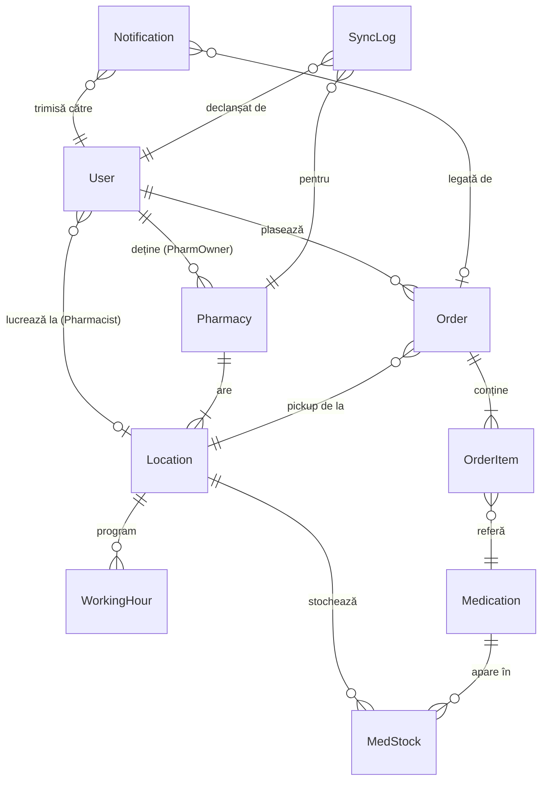
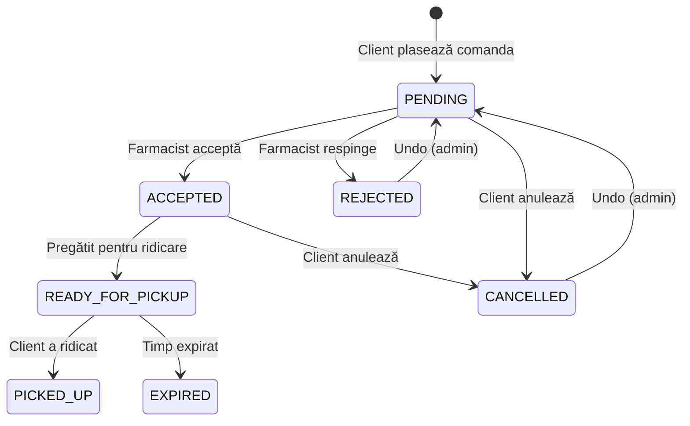

# 📋 Propunere Structură Entități — MedFinder (v2 — Validat)

> Pachet de bază: `ro.medfinder.medapp.entity`
> Toate clasele la **singular**. Convenții: `camelCase` (Java) / `snake_case` (DB).
> **Status: ✅ Structura validată de utilizator — gata de implementare**

---

## Diagrama Relațiilor (ER Overview)



---

## 🔑 Strategie de Moștenire User — ✅ `SINGLE_TABLE`

### Decizie confirmată: `@Inheritance(strategy = SINGLE_TABLE)`

O singură tabelă `users` cu o coloană discriminator (`dtype` sau `role`). Câmpurile specifice subclaselor (`delivery_address`, `city`, `company_name`, `pharmacy_id`) sunt coloane nullable în aceeași tabelă.

**Avantaje:**
- Fără JOIN-uri la query-uri → performanță mai bună
- Simplitate maximă (diferențele între subclase sunt minime)
- Un singur repository dacă e nevoie de query polimorfic

---

## 1️⃣ User (Clasa de bază)

**Tabelă DB:** `users`

| # | Câmp Java (camelCase) | Coloană DB (snake_case) | Tip Java | Tip DB | Constrângeri | Observații |
|---|----------------------|------------------------|----------|--------|--------------|------------|
| 1 | `id` | `id` | `Long` | `BIGINT` | PK, AUTO_INCREMENT | |
| 2 | `email` | `email` | `String` | `VARCHAR(255)` | UNIQUE, NOT NULL | Login principal |
| 3 | `password` | `password` | `String` | `VARCHAR(255)` | NOT NULL | BCrypt hash |
| 4 | `firstName` | `first_name` | `String` | `VARCHAR(100)` | NOT NULL | |
| 5 | `lastName` | `last_name` | `String` | `VARCHAR(100)` | NOT NULL | |
| 6 | `phone` | `phone` | `String` | `VARCHAR(20)` | | Format: +40... |
| 7 | `role` | `role` | `Role` (Enum) | `VARCHAR(20)` | NOT NULL | `CLIENT`, `SUPER_USER`, `PHARM_OWNER`, `PHARMACIST` |
| 8 | `enabled` | `enabled` | `Boolean` | `BOOLEAN` | NOT NULL, default `true` | Cont activ/inactiv |
| 9 | `createdAt` | `created_at` | `LocalDateTime` | `TIMESTAMP` | NOT NULL | Auto-generat |
| 10 | `updatedAt` | `updated_at` | `LocalDateTime` | `TIMESTAMP` | NOT NULL | Auto-update |

### Subclase (câmpuri adiționale prin moștenire)

#### Client (extends User)

| # | Câmp Java | Coloană DB | Tip Java | Tip DB | Observații |
|---|-----------|-----------|----------|--------|------------|
| 1 | `deliveryAddress` | `delivery_address` | `String` | `VARCHAR(500)` | Adresă preferată (opțional) |
| 2 | `city` | `city` | `String` | `VARCHAR(100)` | Oraș pentru proximity search |

**Relații:**
- `orders` → `@OneToMany(mappedBy = "client")` — comenzile plasate

#### PharmOwner (extends User)

| # | Câmp Java | Coloană DB | Tip Java | Tip DB | Observații |
|---|-----------|-----------|----------|--------|------------|
| 1 | `companyName` | `company_name` | `String` | `VARCHAR(200)` | Numele firmei |

> ~~`cui`~~ — **eliminat** de aici. CUI-ul se pune doar pe entitatea `Pharmacy`.

**Relații:**
- `pharmacies` → `@OneToMany(mappedBy = "owner")` — farmaciile deținute

#### Pharmacist (extends User)

**Relații:**
- `location` → `@ManyToOne` → FK `location_id` → `Location` — locația (punctul de lucru) la care lucrează

> **Notă:** `Pharmacist` nu are câmpuri suplimentare proprii, doar relația către `Location`.
> Prin `location.pharmacy` se poate naviga la farmacia-mamă dacă e nevoie.
> `SuperUser` nu are câmpuri/relații extra → nu necesită subclasă separată, se folosește direct `User` cu `role = SUPER_USER`.
> **Mutare la altă locație** = simplu update pe `location_id`.

---

## 2️⃣ Pharmacy

**Tabelă DB:** `pharmacies`

| # | Câmp Java | Coloană DB | Tip Java | Tip DB | Constrângeri | Observații |
|---|-----------|-----------|----------|--------|--------------|------------|
| 1 | `id` | `id` | `Long` | `BIGINT` | PK, AUTO_INCREMENT | |
| 2 | `name` | `name` | `String` | `VARCHAR(200)` | NOT NULL | "Farmacia Tei", "Dr. Max" |
| 3 | `cui` | `cui` | `String` | `VARCHAR(20)` | UNIQUE | CUI/CIF companie |
| 4 | `phone` | `phone` | `String` | `VARCHAR(20)` | | Contact general |
| 5 | `email` | `email` | `String` | `VARCHAR(255)` | | Email contact |
| 6 | `website` | `website` | `String` | `VARCHAR(500)` | | URL site farmacia |
| 7 | `logoUrl` | `logo_url` | `String` | `VARCHAR(500)` | | URL sau path logo |
| 8 | `active` | `active` | `Boolean` | `BOOLEAN` | NOT NULL, default `true` | Vizibilă pe platformă? |
| 9 | `syncEnabled` | `sync_enabled` | `Boolean` | `BOOLEAN` | NOT NULL, default `false` | Sync CSV/ERP activat? |
| 10 | `syncEndpointUrl` | `sync_endpoint_url` | `String` | `VARCHAR(500)` | | URL endpoint ERP (dacă e cazul) |
| 11 | `createdAt` | `created_at` | `LocalDateTime` | `TIMESTAMP` | NOT NULL | |
| 12 | `updatedAt` | `updated_at` | `LocalDateTime` | `TIMESTAMP` | NOT NULL | |

**Relații:**
- `owner` → `@ManyToOne` → FK `owner_id` → `User` (PharmOwner) — proprietarul
- `locations` → `@OneToMany(mappedBy = "pharmacy")` — punctele de lucru
- `syncLogs` → `@OneToMany(mappedBy = "pharmacy")` — istoricul sync-urilor

> ~~`pharmacists`~~ — **mutat pe `Location`**. Farmaciștii sunt legați de locație, nu de lanțul de farmacii.

---

## 3️⃣ Location

**Tabelă DB:** `locations`

| # | Câmp Java | Coloană DB | Tip Java | Tip DB | Constrângeri | Observații |
|---|-----------|-----------|----------|--------|--------------|------------|
| 1 | `id` | `id` | `Long` | `BIGINT` | PK, AUTO_INCREMENT | |
| 2 | `name` | `name` | `String` | `VARCHAR(200)` | | "Sucursala Unirii" |
| 3 | `address` | `address` | `String` | `VARCHAR(500)` | NOT NULL | Adresa completă |
| 4 | `city` | `city` | `String` | `VARCHAR(100)` | NOT NULL | |
| 5 | `county` | `county` | `String` | `VARCHAR(100)` | NOT NULL | Județ |
| 6 | `postalCode` | `postal_code` | `String` | `VARCHAR(10)` | | Cod poștal |
| 7 | `latitude` | `latitude` | `Double` | `DOUBLE` | | Pentru GeoJSON / hartă |
| 8 | `longitude` | `longitude` | `Double` | `DOUBLE` | | Pentru GeoJSON / hartă |
| 9 | `phone` | `phone` | `String` | `VARCHAR(20)` | | Telefon punct de lucru |
| 10 | `active` | `active` | `Boolean` | `BOOLEAN` | NOT NULL, default `true` | |
| 11 | `createdAt` | `created_at` | `LocalDateTime` | `TIMESTAMP` | NOT NULL | |
| 12 | `updatedAt` | `updated_at` | `LocalDateTime` | `TIMESTAMP` | NOT NULL | |

> ~~`schedule` (String)~~ — **înlocuit** cu entitatea separată `WorkingHour` (vezi secțiunea 3.1).

**Relații:**
- `pharmacy` → `@ManyToOne` → FK `pharmacy_id` → `Pharmacy` — farmacia mamă
- `workingHours` → `@OneToMany(mappedBy = "location", cascade = ALL)` — programul pe zile
- `pharmacists` → `@OneToMany(mappedBy = "location")` — farmaciștii care lucrează aici
- `medStocks` → `@OneToMany(mappedBy = "location")` — stocurile de medicamente
- `orders` → `@OneToMany(mappedBy = "pickupLocation")` — comenzile Click & Collect

> ✅ **Confirmat:** Atât stocul cât și farmaciștii sunt legați de **Location** — autorizare per punct de lucru.

---

### 3.1 WorkingHour (program de lucru per zi)

**Tabelă DB:** `working_hours`

> Entitate simplă care stochează programul de lucru al unei locații, câte un rând per zi a săptămânii.
> Permite logica de **"farmacie deschisă acum"** prin comparare cu `DayOfWeek` + `LocalTime` curent.

| # | Câmp Java | Coloană DB | Tip Java | Tip DB | Constrângeri | Observații |
|---|-----------|-----------|----------|--------|--------------|------------|
| 1 | `id` | `id` | `Long` | `BIGINT` | PK, AUTO_INCREMENT | |
| 2 | `dayOfWeek` | `day_of_week` | `DayOfWeek` (Java Enum) | `VARCHAR(10)` | NOT NULL | `MONDAY` … `SUNDAY` (din `java.time.DayOfWeek`) |
| 3 | `openTime` | `open_time` | `LocalTime` | `TIME` | NOT NULL | Ora deschidere (ex: `08:00`) |
| 4 | `closeTime` | `close_time` | `LocalTime` | `TIME` | NOT NULL | Ora închidere (ex: `20:00`) |
| 5 | `closed` | `closed` | `Boolean` | `BOOLEAN` | NOT NULL, default `false` | `true` = închis toată ziua |

**Relații:**
- `location` → `@ManyToOne` → FK `location_id` → `Location`

**Constrângere compusă:**
- `UNIQUE(location_id, day_of_week)` — o singură intrare per zi per locație

**Exemplu de date:**

| location_id | day_of_week | open_time | close_time | closed |
|-------------|-------------|-----------|------------|--------|
| 1 | MONDAY | 08:00 | 20:00 | false |
| 1 | TUESDAY | 08:00 | 20:00 | false |
| 1 | SATURDAY | 09:00 | 14:00 | false |
| 1 | SUNDAY | — | — | true |

---

## 4️⃣ Medication

**Tabelă DB:** `medications`

| # | Câmp Java | Coloană DB | Tip Java | Tip DB | Constrângeri | Observații |
|---|-----------|-----------|----------|--------|--------------|------------|
| 1 | `id` | `id` | `Long` | `BIGINT` | PK, AUTO_INCREMENT | |
| 2 | `ean` | `ean` | `String` | `VARCHAR(13)` | UNIQUE, NOT NULL | European Article Number (8 sau 13 cifre) |
| 3 | `cimCode` | `cim_code` | `String` | `VARCHAR(20)` | | Cod CIM (Nomenclatorul ANMDMR România) |
| 4 | `atcCode` | `atc_code` | `String` | `VARCHAR(10)` | | Cod ATC (clasificare internațională, ex: `N02BE01`) |
| 5 | `name` | `name` | `String` | `VARCHAR(300)` | NOT NULL | Denumire comercială |
| 6 | `activeSubstance` | `active_substance` | `String` | `VARCHAR(300)` | | Substanța activă (ex: Paracetamol) |
| 7 | `manufacturer` | `manufacturer` | `String` | `VARCHAR(200)` | | Producător |
| 8 | `dosage` | `dosage` | `String` | `VARCHAR(50)` | | "500mg", "10mg/ml" |
| 9 | `form` | `form` | `MedForm` (Enum) | `VARCHAR(30)` | | `TABLET`, `CAPSULE`, `SYRUP`, `CREAM`, `INJECTION`, `DROPS`, `SPRAY`, `OTHER` |
| 10 | `prescriptionRequired` | `prescription_required` | `Boolean` | `BOOLEAN` | NOT NULL, default `false` | Cu/fără rețetă |
| 11 | `description` | `description` | `String` | `TEXT` | | Prospect / descriere |
| 12 | `category` | `category` | `String` | `VARCHAR(100)` | | Categoria (ex: "Antibiotic", "Analgezic") |
| 13 | `imageUrl` | `image_url` | `String` | `VARCHAR(500)` | | URL poză produs |
| 14 | `createdAt` | `created_at` | `LocalDateTime` | `TIMESTAMP` | NOT NULL | |
| 15 | `updatedAt` | `updated_at` | `LocalDateTime` | `TIMESTAMP` | NOT NULL | |

**Relații:**
- `medStocks` → `@OneToMany(mappedBy = "medication")` — stocurile din diverse locații

---

## 5️⃣ MedStock (Entitate de joncțiune — Location ↔ Medication)

**Tabelă DB:** `med_stocks`

> Aceasta este entitatea **Many-to-Many** dintre `Location` și `Medication`, promovată la entitate proprie pentru a stoca câmpuri extra (preț, cantitate, dată sync).

| # | Câmp Java | Coloană DB | Tip Java | Tip DB | Constrângeri | Observații |
|---|-----------|-----------|----------|--------|--------------|------------|
| 1 | `id` | `id` | `Long` | `BIGINT` | PK, AUTO_INCREMENT | |
| 2 | `quantity` | `quantity` | `Integer` | `INT` | NOT NULL, default `0` | Bucăți disponibile |
| 3 | `price` | `price` | `BigDecimal` | `DECIMAL(10,2)` | NOT NULL | Preț per unitate (RON) |
| 4 | `available` | `available` | `Boolean` | `BOOLEAN` | NOT NULL, default `true` | Vizibil/disponibil pe platformă |
| 5 | `lastSyncedAt` | `last_synced_at` | `LocalDateTime` | `TIMESTAMP` | | Ultima sincronizare CSV/ERP |
| 6 | `createdAt` | `created_at` | `LocalDateTime` | `TIMESTAMP` | NOT NULL | |
| 7 | `updatedAt` | `updated_at` | `LocalDateTime` | `TIMESTAMP` | NOT NULL | |

**Relații:**
- `location` → `@ManyToOne` → FK `location_id` → `Location`
- `medication` → `@ManyToOne` → FK `medication_id` → `Medication`

**Constrângere compusă:**
- `UNIQUE(location_id, medication_id)` — un medicament apare o singură dată per locație

---

## 6️⃣ Order

**Tabelă DB:** `orders`

| # | Câmp Java | Coloană DB | Tip Java | Tip DB | Constrângeri | Observații |
|---|-----------|-----------|----------|--------|--------------|------------|
| 1 | `id` | `id` | `Long` | `BIGINT` | PK, AUTO_INCREMENT | |
| 2 | `orderNumber` | `order_number` | `String` | `VARCHAR(30)` | UNIQUE, NOT NULL | Human-readable (ex: `ORD-20260615-0042`) |
| 3 | `status` | `status` | `OrderStatus` (Enum) | `VARCHAR(25)` | NOT NULL | Starea comenzii (vezi enum mai jos) |
| 4 | `totalPrice` | `total_price` | `BigDecimal` | `DECIMAL(10,2)` | NOT NULL | Sumă totală (medicamente) |
| 5 | `holdingFee` | `holding_fee` | `BigDecimal` | `DECIMAL(10,2)` | NOT NULL, default `0.00` | Taxă de rezervare. `0` dacă ≤ 2h, calculată automat dacă rezervă mai mult |
| 6 | `notes` | `notes` | `String` | `TEXT` | | Note client (ex: "Rog confirmare telefonică") |
| 7 | `rejectionReason` | `rejection_reason` | `String` | `VARCHAR(500)` | | Motiv respingere (dacă e cazul) |
| 8 | `estimatedPickupTime` | `estimated_pickup_time` | `LocalDateTime` | `TIMESTAMP` | | Ora estimată de ridicare |
| 9 | `pickedUpAt` | `picked_up_at` | `LocalDateTime` | `TIMESTAMP` | | Când a fost ridicată efectiv |
| 10 | `expiresAt` | `expires_at` | `LocalDateTime` | `TIMESTAMP` | | Deadline ridicare (după care se anulează) |
| 11 | `createdAt` | `created_at` | `LocalDateTime` | `TIMESTAMP` | NOT NULL | |
| 12 | `updatedAt` | `updated_at` | `LocalDateTime` | `TIMESTAMP` | NOT NULL | |

**Relații:**
- `client` → `@ManyToOne` → FK `client_id` → `User` — clientul care a plasat comanda
- `pickupLocation` → `@ManyToOne` → FK `pickup_location_id` → `Location` — unde ridică
- `items` → `@OneToMany(mappedBy = "order", cascade = ALL)` — produsele din comandă

---

## 7️⃣ OrderItem

**Tabelă DB:** `order_items`

| # | Câmp Java | Coloană DB | Tip Java | Tip DB | Constrângeri | Observații |
|---|-----------|-----------|----------|--------|--------------|------------|
| 1 | `id` | `id` | `Long` | `BIGINT` | PK, AUTO_INCREMENT | |
| 2 | `quantity` | `quantity` | `Integer` | `INT` | NOT NULL, min `1` | Cantitate comandată |
| 3 | `unitPrice` | `unit_price` | `BigDecimal` | `DECIMAL(10,2)` | NOT NULL | Prețul la momentul comenzii |
| 4 | `subtotal` | `subtotal` | `BigDecimal` | `DECIMAL(10,2)` | NOT NULL | `quantity × unitPrice` |

**Relații:**
- `order` → `@ManyToOne` → FK `order_id` → `Order`
- `medication` → `@ManyToOne` → FK `medication_id` → `Medication`

---

## 8️⃣ Notification

**Tabelă DB:** `notifications`

| # | Câmp Java | Coloană DB | Tip Java | Tip DB | Constrângeri | Observații |
|---|-----------|-----------|----------|--------|--------------|------------|
| 1 | `id` | `id` | `Long` | `BIGINT` | PK, AUTO_INCREMENT | |
| 2 | `type` | `type` | `NotificationType` (Enum) | `VARCHAR(15)` | NOT NULL | `EMAIL`, `SMS`, `IN_APP` |
| 3 | `subject` | `subject` | `String` | `VARCHAR(300)` | | Subiect email / titlu notificare |
| 4 | `message` | `message` | `String` | `TEXT` | NOT NULL | Corpul mesajului |
| 5 | `status` | `status` | `NotificationStatus` (Enum) | `VARCHAR(15)` | NOT NULL | `PENDING`, `SENT`, `FAILED`, `READ` |
| 6 | `targetAddress` | `target_address` | `String` | `VARCHAR(255)` | | Email/nr telefon destinatar |
| 7 | `sentAt` | `sent_at` | `LocalDateTime` | `TIMESTAMP` | | Când s-a trimis efectiv |
| 8 | `readAt` | `read_at` | `LocalDateTime` | `TIMESTAMP` | | Când a fost citită (IN_APP) |
| 9 | `createdAt` | `created_at` | `LocalDateTime` | `TIMESTAMP` | NOT NULL | |

**Relații:**
- `recipient` → `@ManyToOne` → FK `recipient_id` → `User`
- `relatedOrder` → `@ManyToOne` → FK `related_order_id` → `Order` (nullable)

---

## 9️⃣ SyncLog

**Tabelă DB:** `sync_logs`

> Logarea fiecărui import CSV / ERP, pentru audit și debugging.

| # | Câmp Java | Coloană DB | Tip Java | Tip DB | Constrângeri | Observații |
|---|-----------|-----------|----------|--------|--------------|------------|
| 1 | `id` | `id` | `Long` | `BIGINT` | PK, AUTO_INCREMENT | |
| 2 | `syncType` | `sync_type` | `SyncType` (Enum) | `VARCHAR(15)` | NOT NULL | `CSV`, `ERP_API`, `MANUAL` |
| 3 | `status` | `status` | `SyncStatus` (Enum) | `VARCHAR(20)` | NOT NULL | `IN_PROGRESS`, `SUCCESS`, `PARTIAL_FAILURE`, `FAILED` |
| 4 | `fileName` | `file_name` | `String` | `VARCHAR(300)` | | Numele fișierului CSV (dacă e cazul) |
| 5 | `totalRecords` | `total_records` | `Integer` | `INT` | | Câte înregistrări conținea fișierul |
| 6 | `processedRecords` | `processed_records` | `Integer` | `INT` | | Câte s-au procesat cu succes |
| 7 | `failedRecords` | `failed_records` | `Integer` | `INT` | | Câte au eșuat |
| 8 | `errorDetails` | `error_details` | `String` | `TEXT` | | Detalii erori (JSON sau text) |
| 9 | `startedAt` | `started_at` | `LocalDateTime` | `TIMESTAMP` | NOT NULL | |
| 10 | `completedAt` | `completed_at` | `LocalDateTime` | `TIMESTAMP` | | |

**Relații:**
- `pharmacy` → `@ManyToOne` → FK `pharmacy_id` → `Pharmacy`
- `triggeredBy` → `@ManyToOne` → FK `triggered_by_id` → `User`

**Strategie de sync (service layer, nu entitate):**
- **Manual (on init):** Import inițial din CSV/Excel ANMDMR — se rulează o dată dacă DB-ul nu e pre-populat
- **Automat (cronjob):** Spring `@Scheduled` care rulează periodic (ex: zilnic) și importă delta-ul de stocuri de la farmacii
- **Manual (admin):** Endpoint REST pentru sync manual, declanșat din admin panel
- Fiecare execuție (manuală sau automată) creează un rând în `sync_logs` pentru audit

---

## 📊 Enum-uri (toate vor fi clase Java separate)

### `Role`
```
CLIENT, SUPER_USER, PHARM_OWNER, PHARMACIST
```

### `OrderStatus` — Diagrama tranzițiilor de stare



Valori: `PENDING`, `ACCEPTED`, `REJECTED`, `READY_FOR_PICKUP`, `PICKED_UP`, `CANCELLED`, `EXPIRED`

### `MedForm`
```
TABLET, CAPSULE, SYRUP, CREAM, OINTMENT, INJECTION, DROPS, SPRAY, SUPPOSITORY, PATCH, OTHER
```

### `NotificationType`
```
EMAIL, SMS, IN_APP
```

### `NotificationStatus`
```
PENDING, SENT, FAILED, READ
```

### `SyncType`
```
CSV, ERP_API, MANUAL
```

### `SyncStatus`
```
IN_PROGRESS, SUCCESS, PARTIAL_FAILURE, FAILED
```

---

## 🧩 Clasa de bază pentru Audit — `BaseEntity`

Propun o clasă `@MappedSuperclass` din care toate entitățile moștenesc câmpurile de audit:

```
BaseEntity (abstract, @MappedSuperclass)
├── id          : Long (PK)
├── createdAt   : LocalDateTime (@CreationTimestamp)
└── updatedAt   : LocalDateTime (@UpdateTimestamp)
```

Astfel, fiecare entitate concretă moștenește `id`, `createdAt`, `updatedAt` fără duplicare de cod.

---

## 📐 Rezumat Relații

| Relație | Tip | FK în tabelă | Observații |
|---------|-----|-------------|------------|
| User (PharmOwner) → Pharmacy | `@OneToMany` | `pharmacies.owner_id` | Un owner poate deține N farmacii |
| User (Pharmacist) → Location | `@ManyToOne` | `users.location_id` | Un farmacist lucrează la o locație specifică |
| Pharmacy → Location | `@OneToMany` | `locations.pharmacy_id` | O farmacie are N puncte de lucru |
| Location → WorkingHour | `@OneToMany` | `working_hours.location_id` | Program de lucru per zi |
| Location ↔ Medication (via MedStock) | M:N promovată | `med_stocks.location_id`, `med_stocks.medication_id` | Stoc per locație, cu preț și cantitate |
| User (Client) → Order | `@OneToMany` | `orders.client_id` | Un client are N comenzi |
| Order → Location | `@ManyToOne` | `orders.pickup_location_id` | De unde se ridică |
| Order → OrderItem | `@OneToMany` | `order_items.order_id` | Produsele din comandă |
| OrderItem → Medication | `@ManyToOne` | `order_items.medication_id` | Ce medicament e comandat |
| Notification → User | `@ManyToOne` | `notifications.recipient_id` | Cui e trimisă |
| Notification → Order | `@ManyToOne` | `notifications.related_order_id` | Legată opțional de o comandă |
| SyncLog → Pharmacy | `@ManyToOne` | `sync_logs.pharmacy_id` | Pentru ce farmacie s-a făcut sync |
| SyncLog → User | `@ManyToOne` | `sync_logs.triggered_by_id` | Cine a declanșat sync-ul |

---

## ✅ Decizii Confirmate

| # | Întrebare | Decizie | Detalii |
|---|-----------|---------|--------|
| 1 | Strategie moștenire User | **`SINGLE_TABLE`** | O tabelă `users`, coloane nullable pentru câmpurile specifice subclaselor |
| 2 | MedStock pe Location vs Pharmacy | **Location** | Stoc per punct de lucru, nu per lanț. Pharmacy → Location e `@OneToMany`, Location ↔ Medication e M:N prin MedStock |
| 3 | CUI pe PharmOwner vs Pharmacy | **Doar pe Pharmacy** | Eliminat `cui` din PharmOwner, rămâne doar pe `Pharmacy` |
| 4 | OrderItem ca entitate separată | **Da** | Suportă comenzi cu mai multe medicamente |
| 5 | Schedule pe Location | **Entitate `WorkingHour`** | Tabelă separată cu `day_of_week` + `open_time` / `close_time`, permite logica "deschis acum" |
| 6 | Categoria medicamentelor | **String simplu** | `VARCHAR(100)`, fără enum sau entitate separată |

---

> **Structura este finalizată și gata de implementare.** Total: **10 entități** (9 principale + WorkingHour) + **7 enum-uri** + **1 MappedSuperclass** (BaseEntity).
